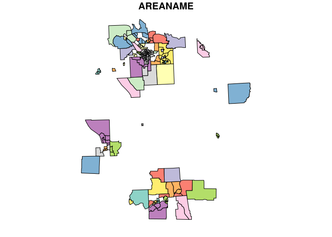

<!-- README.md is generated from README.Rmd. Please edit that file -->

# lazysf

<!-- badges: start -->

[](https://CRAN.R-project.org/package=lazysf)
[](https://cran.r-project.org/package=lazysf)
<!-- badges: end -->

The goal of lazysf is to provide interactive delayed read of GDAL vector
data sources.

Vector data sources, drawings (a.k.a. “shapefiles”) are files or web
services or databases that provide tables of data fields. These fields
may include spatial geometry data such as points, lines, polygons, and
other planar types composed of paths of coordinates.

lazysf uses the dplyr/dbplyr ‘tbl_lazy’ mechanism by providing a GDAL
DBI-backend like many database packages in R. The convenience function
`lazysf()` provides a single-argument wrapper around the database-like
workflows.

See it in action!

``` r
library(lazysf)
library(sf)
library(dplyr)

url <- "https://github.com/Nowosad/spData/raw/master/inst/shapes/NY8_bna_utm18.gpkg"
(x <- lazysf(url))
#> Warning: <SFSQLConnection> uses an old dbplyr interface
#> ℹ Please install a newer version of the package or contact the maintainer
#> This warning is displayed once every 8 hours.
#> Warning in CPL_read_ogr(dsn, layer, query, as.character(options), quiet, :
#> argument layer is ignored when query is specified
#> Warning in CPL_read_ogr(dsn, layer, query, as.character(options), quiet, :
#> argument layer is ignored when query is specified
#> # Source:   table<"sf_bna2_utm18"> [?? x 13]
#> # Database: SFSQLConnection
#>    AREAKEY     AREANAME      X     Y  POP8 TRACTCAS PROPCAS PCTOWNHOME PCTAGE65P
#>    <chr>       <chr>     <dbl> <dbl> <dbl>    <dbl>   <dbl>      <dbl>     <dbl>
#>  1 36007000100 Binghamt…  4.07 -67.4  3540     3.08 8.7 e-4      0.328     0.147
#>  2 36007000200 Binghamt…  4.64 -66.9  3560     4.08 1.15e-3      0.427     0.235
#>  3 36007000300 Binghamt…  5.71 -67.0  3739     1.09 2.92e-4      0.338     0.138
#>  4 36007000400 Binghamt…  7.61 -66.0  2784     1.07 3.84e-4      0.462     0.119
#>  5 36007000500 Binghamt…  7.32 -67.3  2571     3.06 1.19e-3      0.192     0.142
#>  6 36007000600 Binghamt…  8.56 -66.9  2729     1.06 3.88e-4      0.365     0.141
#>  7 36007000700 Binghamt…  9.21 -67.2  3952     2.09 5.29e-4      0.666     0.231
#>  8 36007000800 Binghamt… 10.2  -66.9   993     0.02 2   e-5      0.667     0.279
#>  9 36007000900 Binghamt…  8.70 -68.3  1908     2.04 1.07e-3      0.459     0.172
#> 10 36007001000 Binghamt…  7.40 -68.1   948     0.02 2.10e-5      0.166     0.179
#> # ℹ more rows
#> # ℹ 4 more variables: Z <dbl>, AVGIDIST <dbl>, PEXPOSURE <dbl>,
#> #   geom <MULTIPOLYGON [m]>
x %>% distinct(AREANAME) %>% arrange(AREANAME) 
#> Warning in CPL_read_ogr(dsn, layer, query, as.character(options), quiet, :
#> argument layer is ignored when query is specified
#> # Source:     SQL [?? x 1]
#> # Database:   SFSQLConnection
#> # Ordered by: AREANAME
#>    AREANAME             
#>    <chr>                
#>  1 <NA>                 
#>  2 Auburn city          
#>  3 Baldwinsville village
#>  4 Barker town          
#>  5 Bayberry-Lynelle Mead
#>  6 Binghamton city      
#>  7 Binghamton town      
#>  8 Brookfield town      
#>  9 Camillus village     
#> 10 Canastota village    
#> # ℹ more rows

plot(st_as_sf(x %>% 
                dplyr::filter(!(AREANAME %LIKE% "Ca%" | AREANAME %LIKE% "Bi%")) %>% 
                dplyr::select(AREANAME, geom)))
#> Warning in CPL_read_ogr(dsn, layer, query, as.character(options), quiet, :
#> argument layer is ignored when query is specified
```



## Limitations

This is very largely format dependent, and by “format” we mean the
*driver* as provided by GDAL.

We make no claims about performance or convenience, it will be affected
by your system and your sf installation - lazysf just takes you closer
the GDAL capabilities.

Performance can be excellent, and may be very competitive compared to
reading an entire data source layer into memory. Really good drivers
include ESRI Shapefile, Geopackage, PostgreSQL/PostGIS, MapInfo File,
ESRI FileGDB, but there are dozens to choose from.

A query on a CSV, GeoJSON, or KML file (local or remote) is entirely
subject to the performance of the matching [GDAL
driver](https://gdal.org/en/stable/drivers/vector/index.html).

- big text files will be slow, they aren’t a format suitable for
  database-like access
- geometry is not automatic for real database formats, and will depend
  on the SQL used
- geometry *is* automatic for non-DB formats
- non-DB formats without a geometry column name will be called
  `_ogr_geometry_`, other non-DB formats like ESRI’s geodatabase have
  other names like `SHAPE`
- non-DB formats have access to special variable names and functions,
  listed on the [OGRSQL
  page](https://gdal.org/en/stable/user/ogr_sql_dialect.html).

Real DBs don’t have these special OGRSQL features, but they do have
their own special syntax which for the most part can be sent straight
through.

When using dplyr verbs (`filter()`, `select()`, `mutate()`,
`transmute()`, `arrange()`, `left_join()`, …) we are also subject to the
rules of SQL translation. There are no specific ones provided by lazysf
but that might change.

Wrappers around lazysf could provide more specific tools for particular
formats.

### Can’t we just do this with sf’s query argument?

Yes (actually that is what lazysf uses) but with sf alone you get a
fully materialized sf data frame, so you better get that query right
first time!

With lazysf you get some control over intermediate steps, potentially
expensive queries will only be run for a preview of the data until you
are ready to fetch it.

## Installation

You can install the dev version of lazysf from
[GitHub](https://github.com/hypertidy/lazysf) with:

``` r
# Enable this universe
options(repos = c(
    hypertidy = 'https://hypertidy.r-universe.dev',
    CRAN = 'https://cloud.r-project.org'))

# Install some packages
install.packages('lazysf')
```

## Example

This is a basic example.

``` r
library(lazysf)
f <- system.file("gpkg/nc.gpkg", package = "sf", mustWork = TRUE)

## specify only the data source
lazysf(f)
#> Warning in CPL_read_ogr(dsn, layer, query, as.character(options), quiet, :
#> argument layer is ignored when query is specified
#> Warning in CPL_read_ogr(dsn, layer, query, as.character(options), quiet, :
#> argument layer is ignored when query is specified
#> # Source:   table<"nc.gpkg"> [?? x 15]
#> # Database: SFSQLConnection
#>     AREA PERIMETER CNTY_ CNTY_ID NAME  FIPS  FIPSNO CRESS_ID BIR74 SID74 NWBIR74
#>    <dbl>     <dbl> <dbl>   <dbl> <chr> <chr>  <dbl>    <int> <dbl> <dbl>   <dbl>
#>  1 0.114      1.44  1825    1825 Ashe  37009  37009        5  1091     1      10
#>  2 0.061      1.23  1827    1827 Alle… 37005  37005        3   487     0      10
#>  3 0.143      1.63  1828    1828 Surry 37171  37171       86  3188     5     208
#>  4 0.07       2.97  1831    1831 Curr… 37053  37053       27   508     1     123
#>  5 0.153      2.21  1832    1832 Nort… 37131  37131       66  1421     9    1066
#>  6 0.097      1.67  1833    1833 Hert… 37091  37091       46  1452     7     954
#>  7 0.062      1.55  1834    1834 Camd… 37029  37029       15   286     0     115
#>  8 0.091      1.28  1835    1835 Gates 37073  37073       37   420     0     254
#>  9 0.118      1.42  1836    1836 Warr… 37185  37185       93   968     4     748
#> 10 0.124      1.43  1837    1837 Stok… 37169  37169       85  1612     1     160
#> # ℹ more rows
#> # ℹ 4 more variables: BIR79 <dbl>, SID79 <dbl>, NWBIR79 <dbl>,
#> #   geom <MULTIPOLYGON [°]>

## specify the data source and a query to run
lazysf(f, query = "SELECT AREA, FIPS, geom FROM \"nc.gpkg\" WHERE AREA < 0.1")
#> Warning in CPL_read_ogr(dsn, layer, query, as.character(options), quiet, :
#> argument layer is ignored when query is specified
#> Warning in CPL_read_ogr(dsn, layer, query, as.character(options), quiet, :
#> argument layer is ignored when query is specified
#> # Source:   SQL [?? x 3]
#> # Database: SFSQLConnection
#>     AREA FIPS                                                               geom
#>    <dbl> <chr>                                                <MULTIPOLYGON [°]>
#>  1 0.061 37005 (((-81.23989 36.36536, -81.24069 36.37942, -81.26284 36.40504, -…
#>  2 0.07  37053 (((-76.00897 36.3196, -76.01735 36.33773, -76.03288 36.33598, -7…
#>  3 0.097 37091 (((-76.74506 36.23392, -76.98069 36.23024, -76.99475 36.23558, -…
#>  4 0.062 37029 (((-76.00897 36.3196, -75.95718 36.19377, -75.98134 36.16973, -7…
#>  5 0.091 37073 (((-76.56251 36.34057, -76.60424 36.31498, -76.64822 36.31532, -…
#>  6 0.072 37181 (((-78.49252 36.17359, -78.51472 36.17522, -78.51709 36.46148, -…
#>  7 0.053 37139 (((-76.29893 36.21423, -76.32423 36.23362, -76.37242 36.25235, -…
#>  8 0.081 37189 (((-81.80622 36.10456, -81.81715 36.10939, -81.82231 36.15786, -…
#>  9 0.063 37143 (((-76.48053 36.07979, -76.53696 36.08792, -76.5756 36.10266, -7…
#> 10 0.044 37041 (((-76.68874 36.29452, -76.64822 36.31532, -76.60424 36.31498, -…
#> # ℹ more rows

## specify the data source and the table/layer to access
lazysf(f, layer = "nc.gpkg") %>% 
  dplyr::select(AREA, FIPS, geom) %>% 
  dplyr::filter(AREA < 0.1)
#> Warning in CPL_read_ogr(dsn, layer, query, as.character(options), quiet, :
#> argument layer is ignored when query is specified
#> Warning in CPL_read_ogr(dsn, layer, query, as.character(options), quiet, :
#> argument layer is ignored when query is specified
#> # Source:   SQL [?? x 3]
#> # Database: SFSQLConnection
#>     AREA FIPS                                                               geom
#>    <dbl> <chr>                                                <MULTIPOLYGON [°]>
#>  1 0.061 37005 (((-81.23989 36.36536, -81.24069 36.37942, -81.26284 36.40504, -…
#>  2 0.07  37053 (((-76.00897 36.3196, -76.01735 36.33773, -76.03288 36.33598, -7…
#>  3 0.097 37091 (((-76.74506 36.23392, -76.98069 36.23024, -76.99475 36.23558, -…
#>  4 0.062 37029 (((-76.00897 36.3196, -75.95718 36.19377, -75.98134 36.16973, -7…
#>  5 0.091 37073 (((-76.56251 36.34057, -76.60424 36.31498, -76.64822 36.31532, -…
#>  6 0.072 37181 (((-78.49252 36.17359, -78.51472 36.17522, -78.51709 36.46148, -…
#>  7 0.053 37139 (((-76.29893 36.21423, -76.32423 36.23362, -76.37242 36.25235, -…
#>  8 0.081 37189 (((-81.80622 36.10456, -81.81715 36.10939, -81.82231 36.15786, -…
#>  9 0.063 37143 (((-76.48053 36.07979, -76.53696 36.08792, -76.5756 36.10266, -7…
#> 10 0.044 37041 (((-76.68874 36.29452, -76.64822 36.31532, -76.60424 36.31498, -…
#> # ℹ more rows


## above was a real database (Geopackage), now with an actual shapefile
shp <- lazysf(system.file("shape/nc.shp", package = "sf", mustWork = TRUE))
#> Warning in CPL_read_ogr(dsn, layer, query, as.character(options), quiet, :
#> argument layer is ignored when query is specified
library(dplyr)
shp %>%
 filter(NAME %LIKE% 'A%') %>%
 mutate(abc = 1.3) %>%
 select(abc, NAME, `_ogr_geometry_`) %>%
 arrange(desc(NAME))  #%>% show_query()
#> Warning in CPL_read_ogr(dsn, layer, query, as.character(options), quiet, :
#> argument layer is ignored when query is specified
#> # Source:     SQL [?? x 3]
#> # Database:   SFSQLConnection
#> # Ordered by: desc(NAME)
#>     abc NAME                                                    `_ogr_geometry_`
#>   <dbl> <chr>                                                      <POLYGON [°]>
#> 1   1.3 Avery     ((-81.94135 35.95498, -81.9614 35.93922, -81.94495 35.91861, …
#> 2   1.3 Ashe      ((-81.47276 36.23436, -81.54084 36.27251, -81.56198 36.27359,…
#> 3   1.3 Anson     ((-79.91995 34.80792, -80.32528 34.81476, -80.27512 35.19311,…
#> 4   1.3 Alleghany ((-81.23989 36.36536, -81.24069 36.37942, -81.26284 36.40504,…
#> 5   1.3 Alexander ((-81.10889 35.7719, -81.12728 35.78897, -81.1414 35.82332, -…
#> 6   1.3 Alamance  ((-79.24619 35.86815, -79.23799 35.83725, -79.54099 35.83699,…
```

Online sources can also work if your build of sf supports.

``` r
# online sources can work
geojson <- file.path("https://raw.githubusercontent.com/SymbolixAU",
                      "geojsonsf/master/inst/examples/geo_melbourne.geojson")
lazysf(geojson)
#> Warning in CPL_read_ogr(dsn, layer, query, as.character(options), quiet, :
#> argument layer is ignored when query is specified
#> Warning in CPL_read_ogr(dsn, layer, query, as.character(options), quiet, :
#> argument layer is ignored when query is specified
#> # Source:   table<"geo_melbourne"> [?? x 8]
#> # Database: SFSQLConnection
#>    geo_melbourne.SA2_NAME       geo_melbourne.polygonId geo_melbourne.SA3_NAME
#>    <chr>                                          <int> <chr>                 
#>  1 Abbotsford                                        70 Yarra                 
#>  2 Albert Park                                       59 Port Phillip          
#>  3 Alphington - Fairfield                            41 Darebin - South       
#>  4 Armadale                                          66 Stonnington - West    
#>  5 Ascot Vale                                        44 Essendon              
#>  6 Brunswick                                         36 Brunswick - Coburg    
#>  7 Brunswick East                                    37 Brunswick - Coburg    
#>  8 Brunswick West                                    38 Brunswick - Coburg    
#>  9 Carlton                                           48 Melbourne City        
#> 10 Carlton North - Princes Hill                      71 Yarra                 
#> # ℹ more rows
#> # ℹ 5 more variables: geo_melbourne.AREASQKM <dbl>,
#> #   geo_melbourne.fillColor <chr>, geo_melbourne.strokeColor <chr>,
#> #   geo_melbourne.strokeWeight <int>,
#> #   geo_melbourne._ogr_geometry_ <POLYGON [°]>
```

Also works on PostgreSQL and many others as per GDAL vector driver
support.

To create a connection string for [GDAL for
PostgreSQL](https://gdal.org/en/stable/drivers/vector/pg.html) use
something like

``` r
DSN <- glue::glue("PG:host='{host}' dbname='{dbname}' user='{user}' password='{password}'")

dbConnect(SFSQL(), DSN)
```

but the same can be done with generic DBI and (for example) the
[Rpostgres package](https://rpostgres.r-dbi.org/). With `SFSQL()` we
just know that it’s executed by GDAL (via sf).

## Some drivers are related

Note that GDAL drivers can be confusing, and it can be important to see
the behaviours GDAL will provide by default. Here see that we can read
from a Geopackage file but not as it was intended. We have used the
driver-prefix to make GDAL choose its SQLite driver rather than the
Geopackage driver.

``` r
library(lazysf)
gpkgfile <- system.file("gpkg/nc.gpkg", package = "sf", mustWork = TRUE)
lazysf(glue::glue("SQLite:{gpkgfile}"))
#> Warning in CPL_read_ogr(dsn, layer, query, as.character(options), quiet, :
#> argument layer is ignored when query is specified
#> Warning in CPL_read_ogr(dsn, layer, query, as.character(options), quiet, :
#> argument layer is ignored when query is specified
#> # Source:   table<"gpkg_contents"> [?? x 10]
#> # Database: SFSQLConnection
#>   table_name data_type identifier description last_change         min_x min_y
#>   <chr>      <chr>     <chr>      <chr>       <dttm>              <dbl> <dbl>
#> 1 nc.gpkg    features  nc.gpkg    ""          2016-09-29 00:57:13 -84.3  33.9
#> # ℹ 3 more variables: max_x <dbl>, max_y <dbl>, srs_id <int>
```

That’s not very spatial, but we can dig in to find out what else is
there.

------------------------------------------------------------------------

## Code of Conduct

Please note that the lazysf project is released with a [Contributor Code
of
Conduct](https://contributor-covenant.org/version/2/0/CODE_OF_CONDUCT.html).
By contributing to this project, you agree to abide by its terms.
